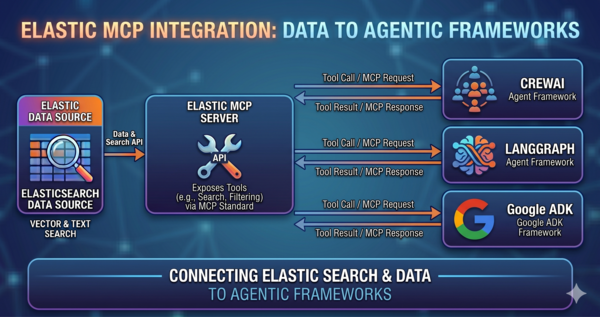
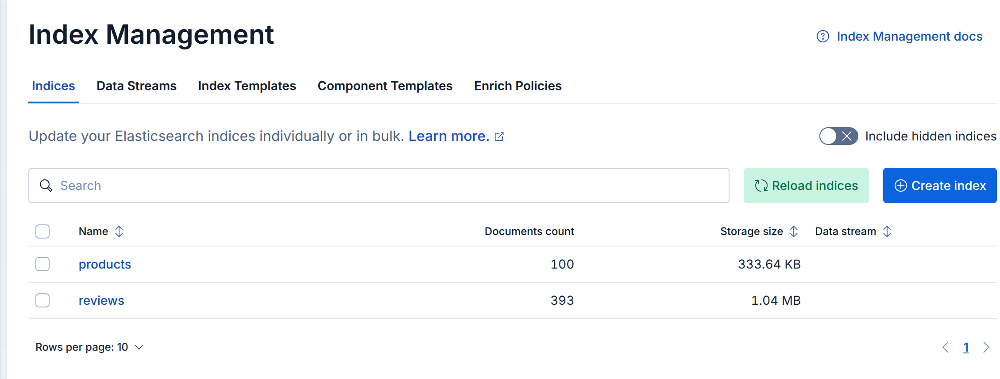
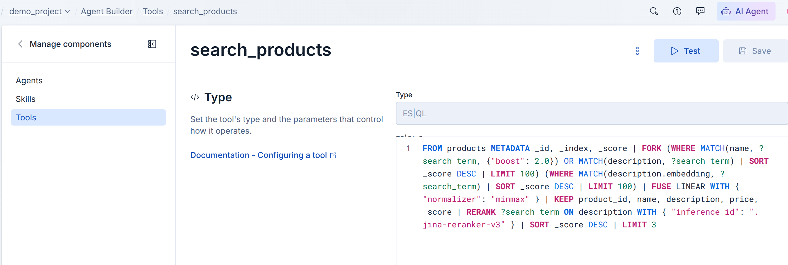
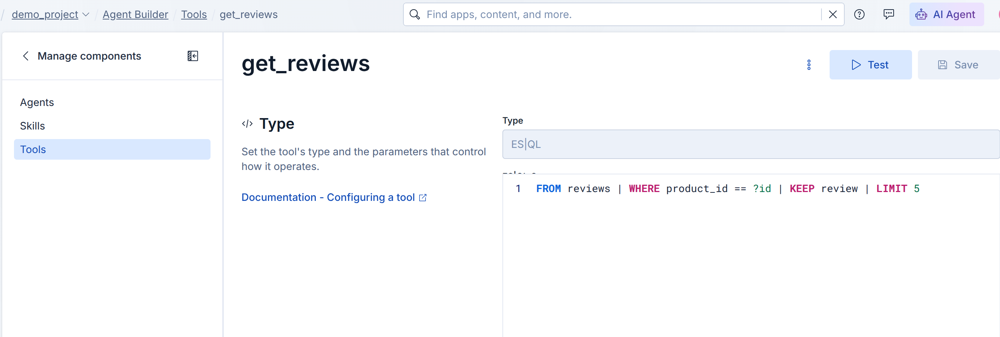

# Bring Your Own Agent: How to Power Any AI Framework with Elastic via MCP
*Integrating Elasticsearch with Third-party Agentic Frameworks*

Elastic has been progressively building a very rich Agentic AI framework called [Agent Builder](https://www.elastic.co/elasticsearch/agent-builder).  You can essentially build an entire Agentic experience via GUI in Kibana today.  But what if you've already made a framework decision but still would like to integrate the data and search tools within Elastic to your Agents?  In this post, I explore that topic and show how that integration can be done in three industry-leading Agentic frameworks:  [Google ADK + Vertex.ai](https://docs.cloud.google.com/agent-builder/agent-development-kit/overview), [LangGraph](https://www.langchain.com/langgraph) and [CrewAI](https://crewai.com/).  

---

## What This Article Covers

- Provisioning an [Elastic Serverless](https://www.elastic.co/cloud/serverless) project via Terraform.
- Indexing a synthetic product catalog and product reviews in Elasticsearch.
- Creating MCP tools in Elastic to search the products and their reviews
- Creating and executing 3 different Product Research Agent scenarios on Google, LangGraph and CrewAI

---

## Architecture


Similar to previous demos, I deploy an Elastic Serverless project via Terraform.  I use Terraform variables and outputs to expose environment variables such as API keys and the Elastic MCP endpoint (Kibana).

One item of note:  I make use of a new [feature](https://www.elastic.co/docs/deploy-manage/api-keys/elastic-cloud-api-keys) in Serverless that allows for unified programmatic access to both your Elastic Cloud organization AND your data with Serverless.  In the past, these were two different keys.  It's possible now to perform both Cloud API and Elasticsearch API calls with one key.

---

## Indexing the Product Catalog and Reviews

I generated 100 synthetic office products and then generated 3-4 reviews for each of those products.  I put the products and reviews in separate indices.  Mappings below:

```python
products_mapping = {
    "mappings": {
        "_meta": {
            "description": "Index of products available in our catalog"
        },
        "properties": {
            "product_id":     {"type": "keyword"},
            "name":           {"type": "text"},
            "description":    {
                "type":     "text",
                "fields":      {"embedding": {"type": "semantic_text"}}
            },
            "category":     {"type": "keyword"},
            "price":        {"type": "float"},
            "stock_count":  {"type": "integer"},
        }
    }
}
reviews_mapping = {
    "mappings": {
        "_meta": {
            "description": "Index of customer reviews for products"
        },
        "properties": {
            "product_id":    {"type": "keyword"},
            "review":   {
                "type":     "text",
                "fields":   {"embedding": {"type": "semantic_text"}}
            }, 
            "stars":        {"type": "integer"},
            "review_date":  {"type": "date"}
        }
    }
}
```

---

## Creating Elastic MCP Tools
I use the Agent Builder REST API to create two ES|QL-based tools: one for product search and the other for fetching the reviews associated with a given product.  The Agent will chain these two tools, along with a third local mock tool for calculating delivery costs, in formulating its responses to the queries we provide.

### Product Search ES|QL
This is a hybrid search (semantic + lexical) utilizing a linear fusion of two.  I also invoke a reranker to fine-tune the hybrid result.  An Agent would use this tool with the user's query to find the appropriate products from the catalog.
```python
esql_1 = '''
FROM products METADATA _id, _index, _score
| FORK
  (WHERE MATCH(name, ?search_term, {"boost": 2.0}) OR MATCH(description, ?search_term) | SORT _score DESC | LIMIT 100)
  (WHERE MATCH(description.embedding, ?search_term) | SORT _score DESC | LIMIT 100)
| FUSE LINEAR WITH { "normalizer": "minmax" }
| KEEP product_id, name, description, price, _score
| RERANK ?search_term ON description WITH { "inference_id": ".jina-reranker-v3" }
| SORT _score DESC
| LIMIT 3
'''
```
```python
    response = requests.post(
        f"{os.environ.get('KIBANA_URL')}{ENDPOINT}",
        headers=headers,
        json={
            "id": TOOL_1_ID,
            "tags": ["office_products"],
            "type": "esql",
            "description": "Search tool for finding products that best match the natural language query provided by the user.",
            "configuration": {
                "query": esql_1,
                "params": {
                    "search_term": {
                        "type": "string",
                        "description": "The natural language query provided by the user to search for relevant products."
                    }
                }
            }
        }
    )
```


### Get Review ES|QL
This is a simple term search for finding reviews associated with a given product.  An Agent would call this tool after it had found the appropriate product from the tool above and now wanted to pull reviews for additional information.
```python
esql_2 = '''
FROM reviews
| WHERE product_id == ?id
| KEEP review
| LIMIT 5
'''
```
```python
    response = requests.post(
        f"{os.environ.get('KIBANA_URL')}{ENDPOINT}",
        headers=headers,
        json={
            "id": TOOL_1_ID,
            "tags": ["office_products"],
            "type": "esql",
            "description": "Search tool for finding products that best match the natural language query provided by the user.",
            "configuration": {
                "query": esql_1,
                "params": {
                    "search_term": {
                        "type": "string",
                        "description": "The natural language query provided by the user to search for relevant products."
                    }
                }
            }
        }
    )
```

---

## Scenario 1 - Google ADK on Vertex.ai
For the first scenario, I use the Google python ADK library to create an Agent that has access to the two Elastic tools above.  I also create a local/mock tool to demonstrate a mix of tools.  I use Gemini Flash 2.5 as my LLM here.

### Agent Query
```python
async for event in remote_agent.async_stream_query(
    user_id="demo_user",
    message=(
        "I'm looking for a standing desk that can fit dual monitors for my home office. "
        "Find me a good option in our catalog, and then summarize what actual customer reviews say about stability and motor noise. "
        "Include estimated shipping cost and delivery time as well."
    ),
):
```
### Agent Response
```text
I found an "Ultra-Wide Standing Desk" for $698.68 that should fit your needs. It's an electric sit-stand desk with dual motors and programmable height presets.

Regarding customer reviews:
*   **Motor Noise**: Users consistently report that the motor is "whisper quiet and very fast" when adjusting the desk height.
*   **Stability**: Several customers mentioned that the desk "wobbles a lot at max height," which can be an issue when typing.

The estimated shipping cost for this desk is $8.99, and it should be delivered within 3-5 business days.
```

---

## Scenario 2 - LangGraph
I follow the same pattern here to build a LangGraph-based Agent that has access to the Elastic tools we built previously.  I use OpenAI GPT 5.4 nano for the LLM.

### Agent Query
```python
async for event in agent.astream_events(
    {"messages": [("user",
        "I need a quiet mechanical keyboard for programming in a shared office. "
        "Find me a good option and summarize what customers say about the typing feel and noise level. "
        "What's the estimated shipping?"
    )]},
    version="v2",
):
```

### Agent Response
```text
Here’s what I did and what I found.

## 1) Picked a good “quiet mechanical” option
From the catalog search, the best match for “quiet mechanical keyboard for programming in a shared office” was **Minimalist Keyboard (Product ID: KEYB-0047)**.

## 2) What customers say (typing feel + noise)
Based on customer reviews:

**Typing feel**
- Customers generally like the tactile feedback: *“The tactile feedback is amazing for typing”* and *“Typing… feels effortless, my wrists thank me.”*
- Some mention the feel isn’t “true mechanical” to everyone: *“Switches feel a bit mushy, not true mechanical feel.”*
- A few quality/comfort notes: *“Build quality is solid aluminum, feels very premium and heavy.”*  
  (and hot-swappable/modding is easy)

**Noise level (important for shared office)**
- The biggest concern: it’s **still quite loud for an open office**:  
  *“...it is quite loud for an open office.”*
- Another reviewer echoes the noise + vibration experience:  
  *“Stabilizers rattle on the spacebar…”* (rattling can add noticeable sound even if the switch itself is “quiet-ish”.)

**Summary for your use case:** great tactile feel for programming, but **expect it to be too loud for some shared-office setups**, mainly due to **spacebar stabilizer rattle**.

## 3) Estimated shipping
**Estimated shipping cost:** **$8.99**  
**Estimated delivery:** **3–5 business days**

If you tell me your preferred layout (**full-size / TKL / 65%**) and whether you want **tactile vs linear**, I can narrow to the quietest option among the catalog (some are better in open-office scenarios than others).
```

---

## Scenario 3 - CrewAI
Finally, I perform the same tool enablement steps via the CrewAI API to instantiate an Agent in this framework.  I use Claude Haiku as my LLM here.

### Agent Request
```python
task = Task(
    description=(
        "I need a high-resolution monitor with accurate colors for design work and coding. "
        "Find me a good option and summarize what customers say about color accuracy and eye strain. "
        "What's the estimated shipping?"
    ),
    expected_output=(
        "A product recommendation with name, price, and product ID, "
        "a summary of customer reviews about color accuracy and eye strain, "
        "and estimated shipping cost and delivery time."
    ),
    agent=agent,
)
```

### Agent Response
```text
## High-Resolution Monitor Recommendation for Design Work and Coding

### Product Recommendation

**Product Name:** Noise-Canceling Monitor Arm
**Product ID:** MONI-0081
**Price:** $395.76

**Product Specifications:**
- 27-inch 4K IPS monitor
- 99% sRGB color accuracy
- USB-C docking for laptops
- High-resolution display suitable for design work and coding

---

### Customer Review Summary

#### Color Accuracy
Customer feedback on color accuracy is **highly positive**:
- **"Color accuracy is stunning right out of the box, great for design work"** - This indicates the monitor delivers excellent color accuracy that is ready to use immediately without calibration, making it ideal for design professionals.
- The 99% sRGB color accuracy specification is confirmed by user experience, showing the monitor performs well for color-critical work.

#### Eye Strain
Customer feedback on eye strain is **positive and encouraging**:
- **"Eye strain is noticeably reduced compared to my old TN panel"** - Users report a significant improvement in comfort when switching from older TN panel monitors to this IPS display. The IPS technology provides better viewing angles and more consistent colors, which reduces eye fatigue during extended design and coding sessions.

#### Additional Customer Insights
- **Smooth Performance for Coding:** "Refresh rate is buttery smooth, makes scrolling through code a pleasure" - The display's refresh rate provides smooth scrolling, which improves the coding experience.
- **Build Quality:** The monitor arm includes adjustable cable management clips and is highly adjustable with tilt, swivel, and height adjustment capabilities.
- **Note:** Some users reported minor issues like occasional dead pixels or backlight bleed in corners with dark content, though these appear to be isolated cases.

```

---

## Conclusion
Elastic's MCP integration provides a clean path between Elastic and whatever agentic framework you've already chosen. As we saw with Google ADK, LangGraph, and CrewAI, the same pair of ES|QL-based tools — a hybrid product search with reranking and a review lookup — plugged into each framework with minimal glue code. Your Elastic data and search capabilities travel with your Agents, regardless of platform.
                                                                                    

## Source Code

Full source [here.](https://github.com/joeywhelan/elastic-mcp-multi-agent-demo)

---